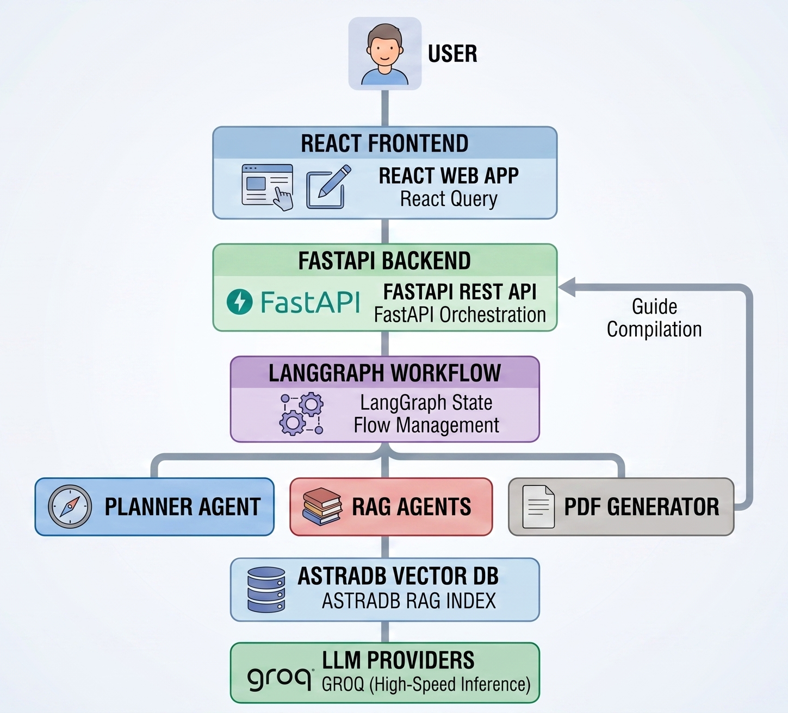
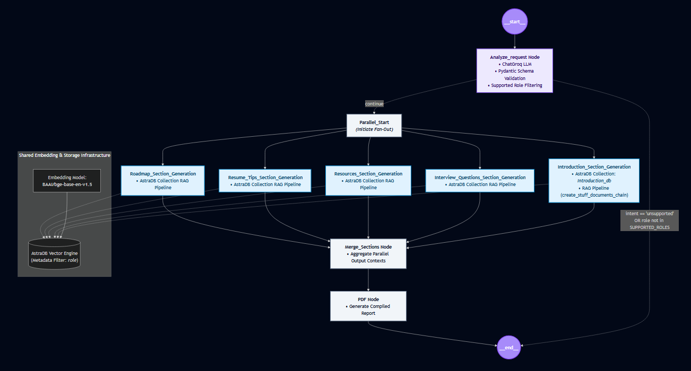

# 🚀 CareerPrep AI - AI Powered Career Preparation Assistant

CareerPrep AI is an **AI-powered career preparation platform** that generates personalized career preparation guides for different technical roles.

The system combines **Large Language Models (LLMs), Retrieval Augmented Generation (RAG), LangGraph workflow orchestration, and vector databases** to create structured career preparation material.

Users can generate complete preparation guides containing:

* Role overview
* Required skills
* Learning roadmap
* Interview preparation
* Project recommendations
* Learning resources
* Downloadable PDF guides

---

# 🌟 Features

## 1. AI Career Guide Generation

Users provide a target role such as:

* AI Engineer
* Software Engineer
* Data Engineer
* DevOps Engineer
* Full Stack Developer

The system generates a complete preparation guide containing:

### Role Overview

Includes:

* Role explanation
* Responsibilities
* Industry expectations
* Required technical knowledge

### Learning Roadmap

Includes:

* Beginner concepts
* Intermediate skills
* Advanced topics
* Practical learning milestones

### Interview Preparation

Includes:

* Technical questions
* Conceptual questions
* Role-specific interview preparation
* System design topics

### Project Recommendations

Includes:

* Beginner projects
* Intermediate projects
* Advanced portfolio projects

### Learning Resources

Includes:

* Documentation
* Courses
* Books
* Practice resources

---

# 🏗️ System Architecture


---

# 🧠 AI Technologies Used

## Large Language Models

LLMs are used for:

* Understanding user requirements
* Generating career guides
* Answer generation
* Content structuring

Supported providers:

* Groq LLM
* HuggingFace Models

---

# 🔗 LangChain

LangChain is used for:

* LLM integration
* Prompt management
* Retrieval pipelines
* Document processing
* Output formatting

Main components:

* Prompt Templates
* LLM Chains
* Retrievers
* Document loaders
* Output parsers

---

# 🔄 LangGraph Workflow

CareerPrep AI uses **LangGraph for workflow orchestration**.

The system does not use independent AI agents. Instead, it uses multiple specialized **RAG processing nodes** running inside a LangGraph workflow.

## Workflow



---

# 📚 Multi-RAG Architecture

CareerPrep AI uses multiple Retrieval Augmented Generation pipelines.

Each RAG module focuses on a specific part of the career guide.

## Roadmap RAG

Generates:

* Learning paths
* Required technologies
* Skill progression

---

## Interview RAG

Generates:

* Technical interview questions
* Concept explanations
* Interview preparation material

---

## Project RAG

Generates:

* Portfolio projects
* Implementation ideas
* Difficulty levels

---

## Resource RAG

Generates:

* Documentation
* Courses
* Books
* Learning resources

---

# 🔍 Retrieval Augmented Generation (RAG)

RAG improves generation quality by providing relevant external knowledge to the LLM.

Workflow:

```
User Query

      ↓

Query Processing

      ↓

Vector Similarity Search

      ↓

Relevant Document Retrieval

      ↓

Context Injection

      ↓

LLM Generation

      ↓

Final Response
```

Benefits:

* Reduces hallucination
* Provides domain-specific knowledge
* Improves response accuracy
* Uses custom knowledge sources

---

# 🗄️ Vector Database

## DataStax AstraDB

CareerPrep AI uses **DataStax AstraDB** as the vector database for storing and retrieving domain-specific knowledge used by the RAG pipelines.

The vector database stores document embeddings along with **custom metadata** to enable more accurate and targeted retrieval.

Used for:

- Storing document embeddings
- Semantic similarity search
- Context retrieval for RAG pipelines
- Metadata-based filtering
- Knowledge separation across different career roles and guide sections

Architecture:

```
Documents

    ↓

Text Chunking

    ↓

Embedding Generation

    ↓

AstraDB Vector Store

    ↓

Similarity Search

    ↓

LLM Context
```

---

# 🖥️ Backend Technology Stack

## FastAPI

Used for:

* REST API development
* Request handling
* Backend services
* API routing

Backend structure:

```
backend/

│
├── app/
│
├── api/
│   ├── guide.py
│   └── health.py
│
├── nodes/
│   ├── roadmap_RAG.py
│   ├── interview_RAG.py
│   ├── projects_RAG.py
│   └── resources_RAG.py
│
├── retrievers/
│
├── prompts/
│
├── graph.py
│
└── main.py
```

---

# 🎨 Frontend Technology Stack

## React

Used for:

* UI components
* User interaction
* State management

## TypeScript

Used for:

* Type safety
* Maintainable frontend development

## Vite

Used for:

* Fast development
* Production builds

## Tailwind CSS

Used for:

* Responsive UI
* Modern styling

Additional libraries:

* Axios → API communication
* Framer Motion → Animations
* React Markdown → Markdown rendering

---

# 📄 PDF Generation

CareerPrep AI generates downloadable PDF preparation guides.

Features:

* Structured formatting
* Markdown conversion
* Professional document layout

Example:

```
AI_Engineer_Career_Guide.pdf
Software_Engineer_Career_Guide.pdf
```

---

# 🔐 Environment Variables

Example:

```env

# AstraDB

ASTRA_DB_API_ENDPOINT=
ASTRA_DB_APPLICATION_TOKEN=


# LLM

GROQ_API_KEY=

HF_TOKEN=

```

Never commit environment variables or secrets to GitHub.

---

# ⚙️ Installation

## Clone Repository

```bash
git clone https://github.com/Noore-hira/CareerPrep_AI.git

cd CareerPrep_AI
```

---

# Backend Setup

```bash
cd backend
```

Create environment:

```bash
python -m venv .venv
```

Install dependencies:

```bash
pip install -r requirements.txt
```

Run backend:

```bash
uvicorn app.main:app --reload
```

Backend:

```
http://localhost:8000
```

Swagger:

```
http://localhost:8000/docs
```

---

# Frontend Setup

```bash
cd frontend
```

Install dependencies:

```bash
pnpm install
```

Run:

```bash
pnpm dev
```

Frontend:

```
http://localhost:5173
```

---

# 🚀 Deployment

## Frontend Deployment

Frontend is deployed on:

**Vercel**

Deployment process:

```
GitHub Repository

        ↓

Vercel Build

        ↓

React Production Bundle

        ↓

Hosted Frontend
```

Production build:

```bash
pnpm build
```

---

## Backend Deployment

Backend is deployed on:

**Red Hat OpenShift Developer Sandbox**

Deployment architecture:

```
FastAPI Application

        ↓

Docker Container

        ↓

OpenShift Deployment

        ↓

Running Backend Pod

        ↓

Public API Route
```

Production command:

```bash
uvicorn app.main:app --host 0.0.0.0 --port $PORT
```

Environment variables are configured through OpenShift.

---

# 🔒 Security

Implemented:

* Environment variable management
* API key handling
* CORS configuration

Production CORS should restrict allowed origins:

```python
allow_origins=[
"https://your-vercel-domain.com"
]
```

---

# 📈 Future Improvements

Possible enhancements:

* User authentication
* Saved career plans
* Progress tracking
* AI mock interviews
* Resume analysis
* Personalized learning paths
* Voice interview simulation

---

# 👨‍💻 Author

Developed as an AI Engineering project demonstrating:

* Generative AI applications
* Retrieval Augmented Generation
* LangGraph workflows
* LLM applications
* Full-stack AI development

---

# ⭐ Tech Stack Summary

| Category               | Technology                            |
| ---------------------- | ------------------------------------- |
| Frontend               | React, TypeScript, Vite, Tailwind CSS |
| Backend                | FastAPI                               |
| AI Framework           | LangChain                             |
| Workflow Orchestration | LangGraph                             |
| Retrieval System       | Multi-RAG Architecture                |
| Vector Database        | AstraDB                               |
| LLM Providers          | Groq, HuggingFace                     |
| API Communication      | Axios                                 |
| PDF Generation         | ReportLab                             |
| Frontend Deployment    | Vercel                                |
| Backend Deployment     | Red Hat OpenShift                     |
